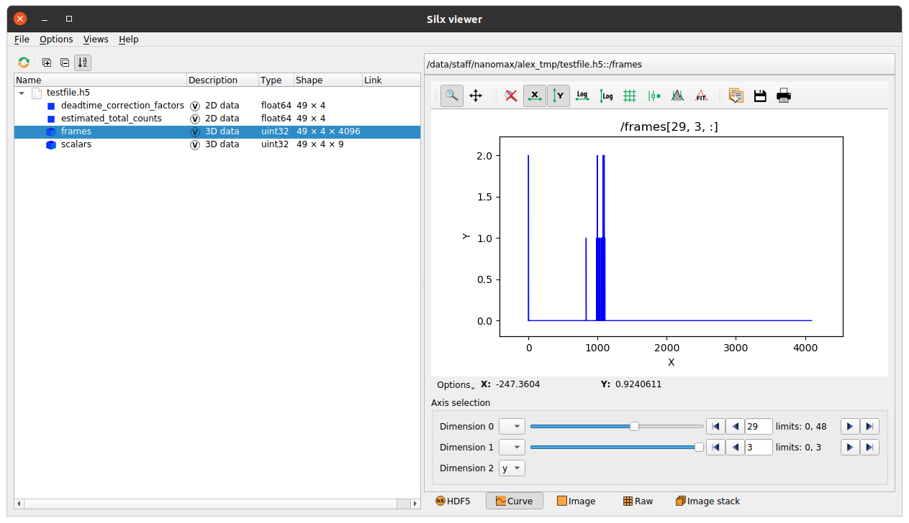

This package provides

- A convenient Python wrapper around the official Xspress3 SDK.
- A threaded streaming utility which continuously streams out the data over zmq
- A Tango device to optionally contain these things, and
- Basic stream receivers for live plotting and fast file writing.

## Pipeline overview

## Data and monitor streams

Two zmq interfaces are presented. An efficient data socket which transfers raw data with minimal latency, and a monitoring socket which gives the latest frame upon request by for example a live viewer.

## Data written

The built-in data writer writes frames together with deadtime correction information and all scalar quantities (event information, exact frame time in clock cycles, etc) to file. Any custom file writer can be hooked up to the zmq data port.

