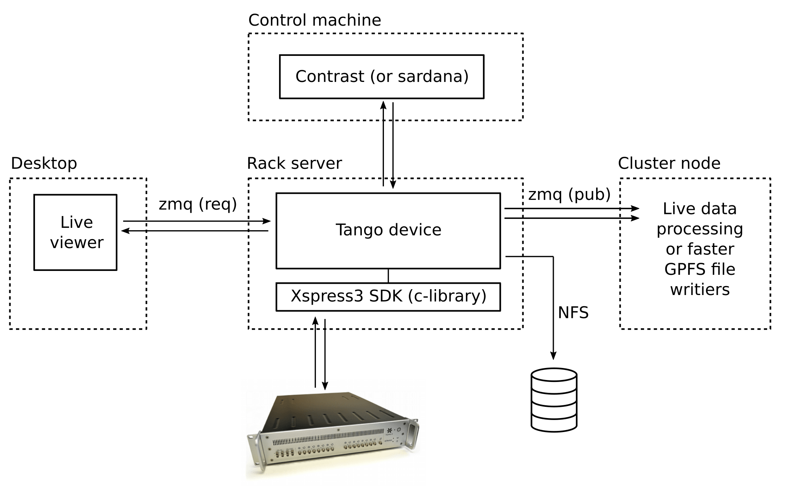

This package provides

- A convenient Python wrapper around the official Xspress3 SDK.
- A threaded streaming utility which continuously streams out the data over zmq
- A Tango device to optionally contain these things, and
- Basic stream receivers for live plotting and fast file writing.

## Pipeline overview

