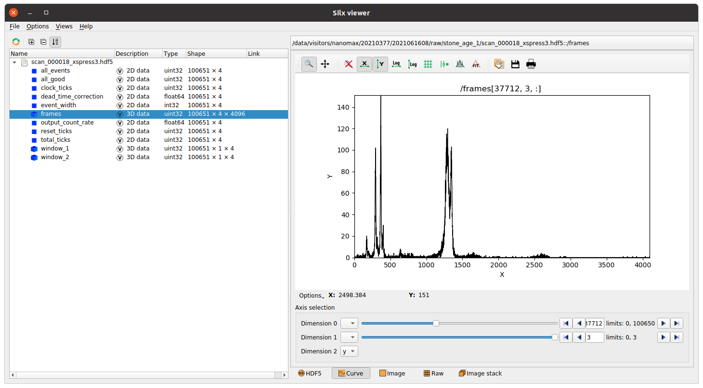

This package provides

- A convenient Python wrapper around the official Xspress3 SDK.
- A threaded streaming utility which continuously streams out the data over zmq
- A Tango device to optionally contain these things, and
- Basic stream receivers for live plotting and fast file writing.

## To-do list
- Direct readback of histogram and scalar data over Tango.
- Expose window counters (aka ROI:s).
- Enable recording only part of the spectrum (what the SDK calls ROI:s).

## Pipeline overview

The core of the pipeline is a process running on the rack server. This process runs the C-library, listens to commands, streams out data, optionally writes files, and provides live data on the monitoring port upon request. This is done in a dedicated thread, so that the Tango device remains responsive.

Note that the file writing, the downstream receivers, and the live viewer are optional. Sardana controllers are not provided, as NanoMAX runs [contrast](https://github.com/maxiv-science/contrast) instead.

## Data and monitor streams

Two zmq interfaces are presented. An efficient data socket which transfers raw data with minimal latency, and a monitoring socket which gives the latest frame upon request by for example a live viewer.

## Data rates

A quick test shows that the built-in writer thread (writing to the MAX IV storage over NFS) limits average data rates to around 200 Hz. Running on a MAX IV daq node, the rate can go up to 450 Hz, and is limited by resizing and writing the auxiliary datasets (count rate correction, etc). This should be improved.

The Streamer as well as the WritingReceiver print acquisition information. With the Tango device writing its own hdf5 files, all this information can be seen by running the device manually in a terminal. In full streaming mode, the remote receiver will usually run in a terminal and print the monitoring information there.

## Data written

The built-in data writer writes frames together with deadtime correction information and all scalar quantities (event information, exact frame time in clock cycles, etc) to file. Any custom file writer can be hooked up to the zmq data port.

## Limitations
- Currently no auxiliary dimensions are taken care of. Not even sure what these would be.
- Productively using multi-card setups would require additional timing setup.
 
